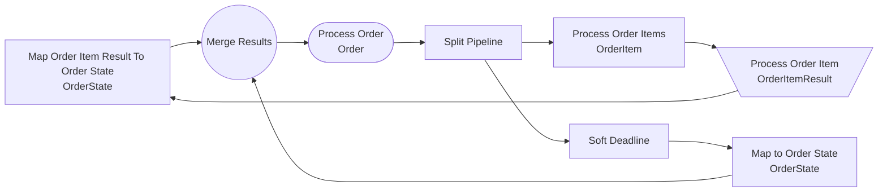

# Pipeline: order

```mermaid
flowchart LR
  s5["Map Order Item Result To Order State
OrderState"]
  s6["Map to Order State
OrderState"]
  s7(("Merge Results"))
  s8(["Process Order
Order"])
  s9[\"Process Order Item
OrderItemResult"/]
  s10["Process Order Items
OrderItem"]
  s11["Soft Deadline"]
  s12["Split Pipeline"]
  s9 --> s5
  s11 --> s6
  s6 --> s7
  s5 --> s7
  s7 --> s8
  s10 --> s9
  s12 --> s10
  s12 --> s11
  s8 --> s12
```
